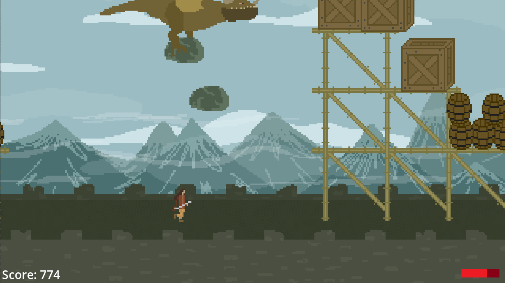
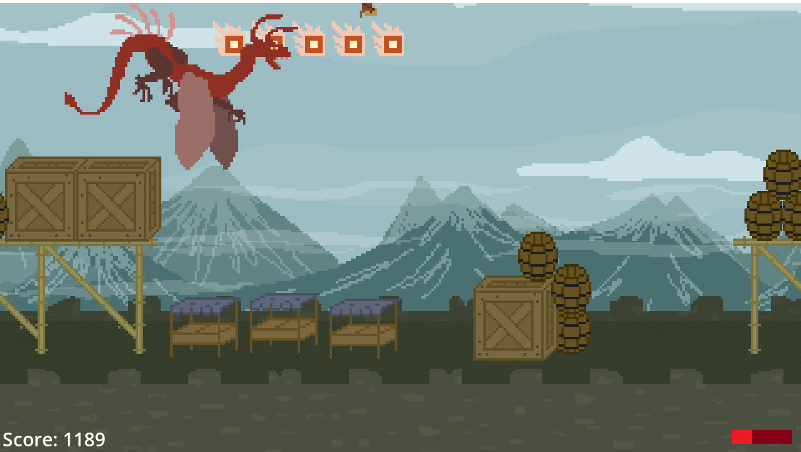

# 🐉 *Reckoning of the Ancients* 🐲

Reckoning of the Ancients is a side-scroller endless runner arcade game created at Hacknarok VII. It was created using Godot game engine in the span of 24 hours. 

## Usage 

Run the ```Reckoning.exe``` executable file.

## Gameplay

Goal of the game is to get highest score possible before losing. You lose either by letting your HP fall to 0 or 
going beyond the left border of the screen. During a run you encounter 3 types of dragons atacking you with different projectiles. The attacks are telegraphed giving you the time to react. The pace of the game constantly increases, making it much more challenging with time and progress.

## Screenshots




